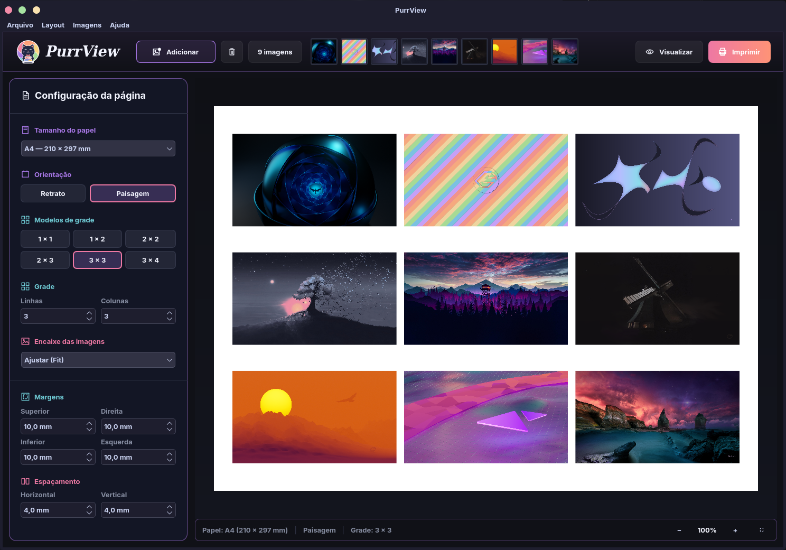
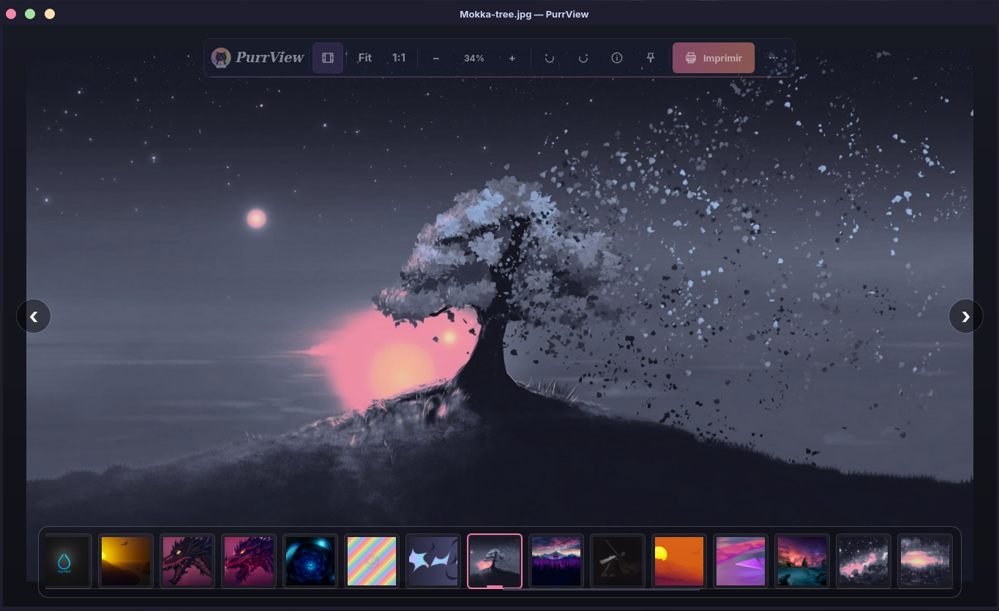

<p align="center">
  
</p>

<h1 align="center">PurrView</h1>

<p align="center">
  <strong>Suas imagens, do primeiro olhar à página impressa.</strong><br>
  Visualizador e compositor de impressão moderno, rápido e integrado ao Linux.
</p>

<p align="center">
  <a href="https://github.com/guedessoftware/purrview/actions/workflows/ci.yml"></a>
  <a href="https://github.com/guedessoftware/purrview/releases/tag/v0.8.12"></a>
  
  
  <a href="LICENSE"></a>
</p>

<p align="center">
  <a href="#-visão-geral">Visão geral</a> ·
  <a href="#-recursos">Recursos</a> ·
  <a href="#-instalação">Instalação</a> ·
  <a href="#-compilar-e-testar">Desenvolvimento</a> ·
  <a href="#-licença">Licença</a>
</p>

---



## ✨ Visão geral

O **PurrView** reúne dois fluxos que normalmente ficam separados em aplicativos diferentes:

| Viewer | Composer |
|---|---|
| Navegação rápida pelas imagens de uma pasta | Organização visual em páginas prontas para impressão |
| Zoom, pan e rotação não destrutiva | Grades, presets, margens e espaçamentos configuráveis |
| Filmstrip retrátil e painel de metadados | Paginação automática conforme novas imagens são adicionadas |
| Seleção de várias imagens para impressão | Reordenação, duplicação e remoção sem alterar os arquivos originais |

A sessão é compartilhada entre os módulos. Você pode selecionar fotografias no Viewer, enviá-las ao
Composer e voltar sem perder a imagem atual, a seleção ou os ajustes da composição.

## 🐾 Recursos

- Interface escura com identidade visual PurrView e controles translúcidos sobre a imagem.
- Abertura por botão, linha de comando, arrastar e soltar, área de transferência e menu do Dolphin.
- Miniaturas progressivas com cache LRU limitado para manter pastas grandes responsivas.
- Grades de `1 × 1` a `3 × 4`, além de quantidade personalizada de linhas e colunas.
- Papéis, orientação, margens, espaçamentos e modos **Fit**, **Fill** e **Stretch**.
- Novas páginas criadas automaticamente quando a grade atual fica completa.
- Impressão nativa via CUPS e diálogo do sistema.
- EXIF avançado com Exiv2 quando disponível, mantendo fallback somente com Qt.
- Instância única por usuário e integração com associações de arquivo do desktop Linux.

## 🖼️ Viewer



A toolbar flutuante oferece Fit, tamanho real, zoom, rotação, informações e impressão. O filmstrip
surge ao navegar ou aproximar o ponteiro da borda inferior e se recolhe suavemente quando não está
em uso, preservando a experiência imersiva.

## 📷 Formatos suportados

| Formato | Extensões | Disponibilidade |
|---|---|---|
| PNG | `.png` | Qt padrão |
| JPEG | `.jpg`, `.jpeg` | Qt padrão |
| WebP | `.webp` | Qt Image Formats |
| BMP | `.bmp` | Qt padrão |
| GIF | `.gif` | Qt padrão |
| TIFF | `.tif`, `.tiff` | Qt Image Formats |
| AVIF | `.avif` | Codec disponível no sistema |
| HEIF/HEIC | `.heif`, `.heic` | KImageFormats ou codec equivalente |
| ICNS | `.icns` | KImageFormats ou codec equivalente |

O aplicativo detecta os codecs reais do ambiente e não anuncia como disponível um formato que o
Qt instalado não consegue decodificar.

## 📦 Instalação

<p align="center">
  <a href="https://github.com/guedessoftware/purrview/releases/tag/v0.8.12"></a>
</p>

Escolha o pacote da sua distribuição, baixe pelo link e execute o comando correspondente no
diretório em que o arquivo foi salvo:

| Sistema | Download | Comando de instalação |
|---|---|---|
| Ubuntu, Mint, Zorin e Debian | [Baixar `.deb`](https://github.com/guedessoftware/purrview/releases/download/v0.8.12/purrview_0.8.12_amd64.deb) | `sudo apt install ./purrview_0.8.12_amd64.deb` |
| Fedora, AlmaLinux, Rocky e RHEL | [Baixar `.rpm`](https://github.com/guedessoftware/purrview/releases/download/v0.8.12/purrview-0.8.12-1.x86_64.rpm) | `sudo dnf install ./purrview-0.8.12-1.x86_64.rpm` |
| openSUSE | [Baixar `.rpm`](https://github.com/guedessoftware/purrview/releases/download/v0.8.12/purrview-0.8.12-1.x86_64.rpm) | `sudo zypper install ./purrview-0.8.12-1.x86_64.rpm` |
| Arch, Garuda, EndeavourOS e Manjaro | [Baixar pacote Arch](https://github.com/guedessoftware/purrview/releases/download/v0.8.12/purrview-0.8.12-1-x86_64.pkg.tar.zst) | `sudo pacman -U ./purrview-0.8.12-1-x86_64.pkg.tar.zst` |
| Qualquer distribuição com Flatpak | [Baixar `.flatpak`](https://github.com/guedessoftware/purrview/releases/download/v0.8.12/PurrView-0.8.12-x86_64.flatpak) | `flatpak install --user ./PurrView-0.8.12-x86_64.flatpak` |
| Instalação nativa assistida | [Baixar bootstrap](https://github.com/guedessoftware/purrview/releases/download/v0.8.12/PurrView-0.8.12-bootstrap.tar.xz) | `tar -xf PurrView-0.8.12-bootstrap.tar.xz && cd PurrView-0.8.12-bootstrap && ./scripts/install-impage.sh --user` |
| Compilação manual | [Baixar código-fonte](https://github.com/guedessoftware/purrview/releases/download/v0.8.12/PurrView-0.8.12-source.tar.xz) | Consulte [Compilar e testar](#-compilar-e-testar) |

Os hashes estão em [SHA256SUMS](https://github.com/guedessoftware/purrview/releases/download/v0.8.12/SHA256SUMS). Depois de baixar o pacote e esse arquivo, confira a integridade com:

```bash
sha256sum -c SHA256SUMS --ignore-missing
```

Na primeira instalação por Flatpak, configure o Flathub antes de abrir o bundle. Não é necessário
instalar `flatpak-builder` para usar o pacote pronto:

```bash
flatpak remote-add --user --if-not-exists flathub \
  https://dl.flathub.org/repo/flathub.flatpakrepo
flatpak install --user ./PurrView-0.8.12-x86_64.flatpak
flatpak run io.github.impage.Impage
```

Para uma instalação nativa por usuário diretamente do código-fonte:

```bash
scripts/install-impage.sh --check
scripts/install-impage.sh --user
```

Execute o instalador como usuário normal, sem `sudo`. Ele solicitará privilégios somente se alguma
dependência do sistema estiver ausente. Para tornar o Viewer padrão nos formatos compatíveis:

```bash
scripts/install-impage.sh --user --set-default-viewer
```

Mais detalhes e instruções de atualização estão em [docs/installation.md](docs/installation.md).

## 🚀 Uso rápido

Abra o Composer pelo menu de aplicativos ou execute:

```bash
purrview
```

Abra imagens diretamente no Viewer:

```bash
purrview foto1.jpg foto2.png foto3.webp
purrview --viewer foto1.jpg foto2.png
```

Envie arquivos diretamente ao Composer:

```bash
purrview --compose foto1.jpg foto2.png
```

Também é possível arrastar arquivos para a janela, colar com `Ctrl+V` ou selecionar várias imagens
no Dolphin e usar **Montar no PurrView** no menu de contexto.

### Organizando uma composição

- Clique em uma miniatura para abrir a página correspondente.
- Use `Ctrl+clique` para marcar ou desmarcar imagens e `Shift+clique` para selecionar um intervalo.
- Clique, segure e arraste uma miniatura — ou a imagem dentro da página — para alterar a ordem.
- Use `Ctrl+D` para duplicar e `Delete` para remover somente da composição.
- Navegue pelas páginas com `PgUp` e `PgDown`.

Nenhuma dessas operações modifica ou apaga os arquivos de imagem originais.

## ⌨️ Atalhos principais

| Atalho | Viewer | Composer |
|---|---|---|
| `Ctrl+O` | — | Adicionar imagens |
| `Ctrl+V` | — | Colar imagens |
| `Ctrl+P` | Compor e imprimir a seleção | Imprimir a composição |
| `Ctrl+A` | Selecionar as imagens da pasta | Adicionar imagens |
| `Ctrl+D` | — | Duplicar as selecionadas |
| `Delete` | Enviar a imagem à lixeira com confirmação | Remover da composição |
| `←` / `→` | Imagem anterior/próxima | — |
| `+` / `-` | Ajustar zoom | — |
| `0` / `1` | Fit / tamanho real | — |
| `R` / `Shift+R` | Girar à direita/esquerda | — |
| `I` | Mostrar informações | — |
| `F11` | Alternar tela cheia | — |
| `F1` | Mostrar atalhos | Mostrar atalhos |

## 🛠️ Compilar e testar

### Requisitos

- CMake 3.21 ou mais recente.
- Compilador com suporte a C++20.
- Qt 6.4 ou mais recente: Core, Gui, Network, QML, Quick, Quick Controls 2, Widgets e PrintSupport.
- Exiv2 0.28 ou compatível, opcional para metadados avançados.

### Build Release

```bash
git clone https://github.com/guedessoftware/purrview.git
cd purrview
cmake --preset release
cmake --build --preset release
ctest --preset release --output-on-failure
./build/release/impage
```

Para compilar deliberadamente sem Exiv2:

```bash
cmake -S . -B build/no-exiv -G Ninja \
  -DCMAKE_BUILD_TYPE=Release \
  -DIMPAGE_WITH_EXIV2=OFF
```

## 🧪 Qualidade e pacotes reproduzíveis

Os testes, scripts e workflows fazem parte do repositório. Eles são necessários para verificar o
código e reproduzir os pacotes; binários, builds locais, caches e arquivos `dist/` não são
versionados.

```bash
# Validar a versão e os metadados
scripts/validate-release.sh

# Gerar e testar todos os formatos em ambientes isolados
scripts/package-all.sh
```

O empacotador usa containers de Ubuntu 24.04, AlmaLinux 9 e Arch Linux, além do SDK KDE 6.10 para o
Flatpak. Cada pacote é compilado, testado, instalado e inspecionado antes de receber seu hash
SHA-256. Veja a matriz completa em [docs/packaging.md](docs/packaging.md).

## 🧩 Arquitetura

```text
Shell / ImageSession compartilhada
├── Viewer
│   ├── navegação e seleção
│   ├── cache de miniaturas
│   └── metadados e EXIF
└── Composer
    ├── documento paginado
    ├── motor de layout
    └── renderização e impressão
```

Viewer e Composer são módulos independentes carregados sob demanda. A comunicação entre eles passa
pela sessão compartilhada, evitando dependências diretas e preservando o estado ao trocar de modo.
Consulte [docs/architecture.md](docs/architecture.md) para os detalhes técnicos.

## 🔒 Privacidade

O PurrView trabalha localmente. Ele não envia imagens, caminhos ou metadados para serviços externos.
Coordenadas GPS existentes no EXIF são apenas lidas do arquivo e mostradas no painel de informações;
nenhuma geocodificação online é executada.

## 🤝 Contribuindo

Relatos de bugs e propostas de melhoria são bem-vindos nas
[Issues](https://github.com/guedessoftware/purrview/issues). Antes de enviar uma alteração, execute
o build Release, os testes e o QML lint descritos em [docs/building.md](docs/building.md).

## 📄 Licença

PurrView é software livre distribuído sob a **GNU General Public License versão 3**
(`GPL-3.0-only`). Consulte [LICENSE](LICENSE) para os termos completos. Dependências mantêm suas
próprias licenças, documentadas em [THIRD_PARTY_NOTICES.md](THIRD_PARTY_NOTICES.md).

<p align="center">
  Feito para Linux com C++20, Qt 6 e uma boa dose de ronronar. 🐈
</p>
